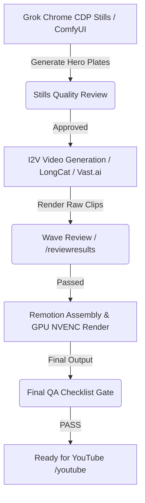

# Islamic Music Video (Nasheed / Asma ul-Husna) Art Direction & Production Playbook

This skill defines the canonical art direction, aesthetic standards, forbidden visual traits, framing grammar, dynamic captions, and safety guidelines for producing high-quality Islamic music videos (MVs) and nasheed shorts/long-form videos.

---

## 1. Purpose & Core Philosophy
The core objective is to deliver a visually stunning, spiritually resonant, and culturally authentic experience for Islamic music videos. Every frame must evoke a sense of devotion (*khushu'*), humility, and peace (*sakinah*). The visuals must respect theological boundaries while leveraging state-of-the-art cinematic tools (Grok, ComfyUI, LongCat, Remotion) to compete with top-tier international productions.

---

## 2. Frame Grammar (Visual Hierarchy)
Every scene must strictly adhere to the following tri-level structural grammar:

1. **Human Devotion First (Primary focus - 60% of runtime):**
   * Visual focus must be on authentic expressions of faith, contemplation, and community.
   * Actions must feel spontaneous, authentic, and emotionally raw (e.g., quiet reflection, hands raised in prayer, sliding beads of a tasbih).
2. **Architecture Second (Supporting backdrop - 25% of runtime):**
   * Islamic architectural elements (arches, minarets, geometric tiling, courtyards, dome shadows, and mud-brick structures).
   * Play of light and shadow (chiaroscuro) passing through geometric lattices (*mashrabiya*).
3. **Nature Third (Transitions / Metaphors - 15% of runtime):**
   * Natural phenomena representing divine creation (flowing water, swaying olive/date trees, desert sands at dawn, starry skies, blooming jasmine, sunbeams breaking through clouds).

---

## 3. Color Palette
The color palette represents a balance between terrestrial devotion and celestial infinite depth. All generated assets and post-processing color grading must match these tones:

| Color Name | Hex Code | Visual Meaning / Usage |
| :--- | :--- | :--- |
| **Warm Ivory** | `#FDFBF7` | Grounding, light, purity, limestone walls, sunlit stone |
| **Deep Teal** | `#004B49` | Growth, life, tranquility, ceramic tile details, shade |
| **Indigo Night** | `#0B132B` | Infinity, celestial scale, night sky, divine mysteries |
| **Amber** | `#D97706` | Devotion, heat, dawn sunbeams, lantern glow |
| **Soft Gold** | `#C5A880` | Premium accents, borders, nameplate details, divine majesty |

---

## 4. Forbidden Elements (Zero-Tolerance Guardrails)
Any wave or final render containing any of the following elements must be quarantined immediately:

* **No Open Mouths or Lip-Sync:** Characters must not sing, talk, or sync their lips to the audio. Expressions should be closed-mouth smiles, silent contemplation, or quiet prayer.
* **No AI-Generated Calligraphy on Plates:** Standard AI generation engines hallucinate Arabic script, creating nonsense glyphs that look disrespectful. Calligraphy must be verified SVG vector files or pre-rendered authentic graphics.
* **No Depictions of the Prophet:** Explicitly forbidden to depict Prophet Muhammad (pbuh), his family members, or any of the Prophets of Islam.
* **No Gore or Violence:** Zero tolerance for violent imagery, blood, or traumatic scenes.
* **No Reused Plates:** Every video must feature unique plates. Repeating the same video sequence across multiple beats is an instant fail.
* **No Watermarks or UI Overlays:** Raw generator stamps or third-party logos must be cropped or painted out before ingestion.

---

## 5. Required Beat Types & Faith Actions
Visual sequences must align with traditional practices and cinematic references:

* **Tawhid Index Finger Sky:** A single finger raised towards the sky representing the unity of God (Tawhid). Framed as a medium close-up, silhouetted against a golden hour sky.
* **Sajdah (Prostration):** Cinematic side profile of prostration, low angle, emphasizing humility.
* **Ruku (Bowing):** Back-lit wide shot of bowing in prayer, long shadows cast on marble floors.
* **Dua Palms:** Opened palms raised towards the face, softly lit from above (simulating divine light).
* **Mosque Interiors:** Slow panning shots of grand empty halls, sunlight filtering through stained glass, geometric carpets.
* **Diverse Closed-Mouth Smiling Listeners:** Portraits of individuals listening to the nasheed, displaying peace.
* **Generational Depth:** Intersperse shots of elders with deep facial creases alongside young children learning or reflecting.
* **Wudu (Ablution):** Close-up of water pouring over hands, droplets falling on stone.
* **Tasbih (Prayer Beads):** Close-ups of fingers moving slowly over wooden or clay beads.

---

## 6. Diversity Axes
Islam is a global faith. The video plates must reflect the ethnic and cultural diversity of the global Ummah:
* **Geographic Regions:** South Asia, Middle East, North Africa, East Africa, Southeast Asia (Indonesia/Malaysia), Central Asia, and Western diaspora.
* **Age Distribution:** Children, youth, parents, and elders with distinguished features.
* **Attire:** Culturally diverse, modest clothing (e.g., thobes, shalwar kameez, batiks, varied hijab styles, turbans) matching the region represented.

---

## 7. Caption Standards (Remotion Integration)
All subtitles and overlays must follow this layout in Remotion:
* **Arabic Lyric / NameCard:** Large, centered, using a premium traditional font (e.g., Amiri or Scheherazade New) colored in **Soft Gold (`#C5A880`)** with a subtle drop shadow.
* **English Translation:** Clean sans-serif font (e.g., Inter or Outfit) in white (`#FFFFFF`) or Warm Ivory (`#FDFBF7`), positioned directly below the Arabic text.
* **Animation:** Smooth fade-in and slide-up transitions using custom easing curves (no harsh cuts).

---

## 8. Audio-Reactive Music Bar
* A thin, elegant music visualizer must be rendered at the bottom **6%** of the frame height.
* The visualizer color must use **Soft Gold (`#C5A880`)** with varying opacities.
* It must dynamically react to the frequency spectrum of the nasheed track (e.g., bass frequencies scaling center bars, higher frequencies scaling outer bars).

---

## 9. Safe Zones

### Long 16:9 (Hayat default — 1920×1080)
* **Top 8%:** clear (no text / no watermark unless pack requires)
* **Bottom 0–6%:** music bar only
* **Bottom 12–28%:** NameCard (Arabic + English lyric)
* **Center 30–80%:** B-roll faces / architecture / nature
* **Side 10% margins:** keep critical faces inward

### Shorts 9:16 (phase-2 cuts only)
* **Top 15%:** platform chrome / optional watermark
* **Bottom 20%:** keep faces clear of UI
* **Captions:** Y ≈ 65–75%

---

## 10. Generation & Production Pipeline
Adhere strictly to this pipeline using local and cloud assets:

1. **Stills Generation:** Use `/localimage` (ComfyUI Flux) or Grok (SuperHeavy) to generate baseline hero stills.
2. **Identity Lock:** Prioritize character/ likeness consistency across still plates before generating video.
3. **I2V Transition:** Feed approved stills into I2V engines (LongCat or cloud GPU) to generate dynamic, smooth motion.
4. **Remotion Render:** Compile video plates, audio-reactive bars, and captions. Execute compilation with NVENC acceleration:
   `remotion render src/index.ts out.mp4 --gl angle --codec h264_nvenc`

---

## 11. Reuse Quarantine Rules
To prevent the platform "reused content" penalty:
* **Hash Validation:** Run a SHA-256 check on all ingested raw clips against the project's historical directory.
* **Metadata Check:** Ensure every clip has a unique prompt and seed footprint.
* **Visual Deduplication:** Never use the same scene background or character in consecutive videos in the same series. A minimum **30-day quarantine** is required for generic backgrounds.

---

## 12. Review Gates & Wave Control
For bulk productions (N ≥ 10):
1. **Wave Gating:** Produce clips in waves of 2-3 items. Run `/reviewresults --mode wave` on each wave. Do not start the next wave until the current wave receives a "PASS".
2. **Full-Timeline Review:** Inspect frames at 0s, 15s, 30s, and the final 5s of the timeline to verify pacing, audio synchronization, and caption alignment.

---

## 13. Reference Material & Master URL Index
Incorporate and analyze the pacing, aesthetic direction, and editing techniques of these benchmark productions:

* **Sami Yusuf - *The Ninety-Nine Names*** (`tTao6LY05zw`): Focus on high-contrast lighting, slow-moving architectural shadows, and deep emotional resonance.
* **Coke Studio - *Asma-ul-Husna* (Atif Aslam)**: Meditative pacing, grand visual scale, vocal ensemble synchronization, and dark atmospheric blue/indigo color grading.
* **Maher Zain - *Rahmatun Lil'Alameen***: Warm, bright tones (pinks, gold, ivory), outdoor natural lighting, and multi-cultural smiling faces.
* **Omar Esa - *Voice Only Nasheeds***: Visual storytelling relying entirely on human emotion and natural frames to offset the lack of musical instruments.
* **Al-Rawdah Cinema Notes**: Architectural alignment, low-angle mosque photography, and tracking shots through stone archways.
* **Isam B - *Ramadan***: Urban diaspora representation, wudu sequences, and real-world community storytelling.
* **Mustafa - *Name of God***: Raw cinematic realism, modern diaspora framing, and handheld camera style.
* **User Reference - Multi-Nationality Listeners** (`1PNhiHxtuKQ`): Closed-mouth expressions of peace, diverse faces, and micro-expressions showing spiritual connection.

---

## 14. Falsifiable QA Checklist
Before shipping, the auditor must check off every item. If any item is marked "No", the build is BLOCKED.

- [ ] **No Mouth Movement:** Is every character's mouth completely closed when the audio is playing? (Yes/No)
- [ ] **No AI Calligraphy:** Are there any garbled or AI-generated Arabic characters on-screen? (Yes/No - Must be No)
- [ ] **Palette Compliance:** Do the dominant colors in the video fall within the Warm Ivory, Deep Teal, Indigo Night, Amber, and Soft Gold specifications? (Yes/No)
- [ ] **Audio-Reactive Bar Check:** Is the visualizer located within the bottom 6% height and reacting to audio levels? (Yes/No)
- [ ] **Prophet Depiction Check:** Are there any visual representations of religious personalities? (Yes/No - Must be No)
- [ ] **Caption Accuracy:** Have all Arabic and English captions been cross-verified against official script sheets for typos or incorrect translations? (Yes/No)
- [ ] **Remotion GPU Verification:** Was the final compilation rendered using `h264_nvenc` with hardware acceleration enabled? (Yes/No)
