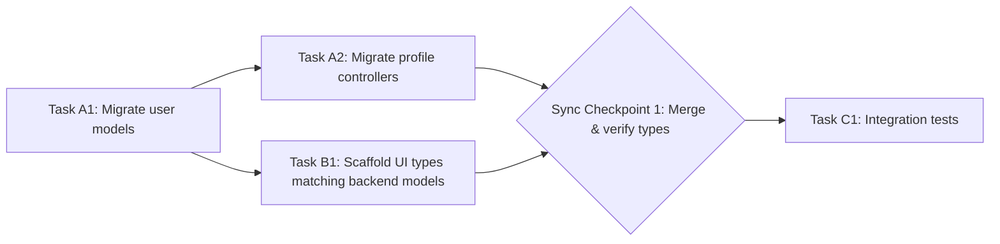

# Parallel Operational Planning

Create structured, parallel operational plans that allow complex tasks to be broken down and worked on concurrently by multiple subagents. Each plan defines tracks, a dependency graph, and hard sync checkpoints that gate progress.

## When to Use

- A massive task list exists where many items are independent (e.g. migrating 20 test files, editing 15 independent configurations, auditing 10 code modules).
- You need to minimize latency by running non-dependent steps concurrently across subagents.
- You are constructing detailed execution plans for multi-track development and need to map task dependencies, synchronization milestones, and subagent allocation.
- Route to `parallel-feature-development` for decoupling source files, or `parallel-planner` for initial high-level task analysis.

## Prerequisites

- A raw task list or feature backlog as input.
- Familiarity with GitHub Flavored Markdown (GFM) task lists and Mermaid diagram syntax.
- (Optional) Git worktrees available if tracks will be mapped to independent folders for concurrent building and verification.
- (Optional) Integration with an automated task manager (e.g. Taskmaster) if plans will be dispatched programmatically.

## Procedure

### 1. Analyze the Input Task List

1. Collect the raw task list or feature backlog.
2. Identify which tasks have zero overlapping state (no shared variables, file edits, or database updates). Only these are candidates for parallel tracks.
3. If Task Y requires any output from Task X, place them in sequential steps within the same track — never in concurrent tracks.

### 2. Define Tracks

1. Group independent tasks into tracks (Track A, Track B, etc.).
2. Limit parallel tracks to a **maximum of 4** to prevent coordination bottlenecks and complex merge resolution loops.
3. Assign an explicit task owner (subagent identifier) to each track.

### 3. Build the Dependency Map

1. Create a Mermaid flowchart or Gantt diagram documenting which tracks depend on others.
2. Verify the dependency graph has **no circular dependency deadlocks**. Every dependency edge must be acyclic.



### 4. Define Sync Checkpoints

1. Schedule a sync checkpoint after a **maximum of 3 concurrent tasks per track** to minimize integration drift.
2. Every checkpoint must include concrete verification steps (e.g. build checks, test runs, type checks).
3. Checkpoints act as **hard gates**: all concurrent branches must be integrated and verified before spawning new tracks.

### 5. Write the Plan Document

Use this template structure:

```markdown
## Track A: Backend Migration
- Owner: subagent-backend
- [ ] Task A1: Migrate user models
- [ ] Task A2: Migrate profile controllers

## Track B: Frontend Types
- Owner: subagent-frontend
- [ ] Task B1: Scaffold UI types matching backend models

## Dependency Rules
- Track B Task B1 cannot start until Task A1 is completed.
- Sync Checkpoint 1: Merge Track A and Track B branches to verify types.

## Sync Checkpoints
### Sync Checkpoint 1
- Gate: All tracks merged to staging branch
- Verification: `npm run build` passes, `npm test` passes, type check passes
- Next phase: Integration tests (Track C)
```

### 6. Dispatch and Monitor

1. Dispatch each track to its assigned subagent.
2. Monitor track progress against the checkpoint schedule.
3. If a track falls behind, do not allow dependent tracks to exceed the sync checkpoint threshold. Pause ahead-of-schedule tracks and reallocate subagents to assist the delayed track.

## Pitfalls

- **Circular dependencies**: If the dependency graph contains a cycle, subagents will deadlock. Always verify the graph is acyclic before dispatch.
- **Overlapping state across tracks**: Tasks that share variables, file edits, or database updates must never run concurrently. Move them to sequential steps within one track.
- **Too many parallel tracks**: Exceeding 4 tracks creates coordination bottlenecks and complex merge conflicts. Hard cap is 4.
- **Checkpoint drift**: If checkpoints are too infrequent (more than 3 tasks per track without a sync), integration drift accumulates and merge failures become likely.
- **Integration failures at checkpoint**: If merging at a checkpoint fails, **halt further track dispatch**. Resolve build or test errors on the main staging branch before launching the next phase. Do not continue parallel work while the checkpoint is broken.
- **Volatile provider APIs**: Re-check official/current docs before relying on provider-specific APIs, policy, pricing, security behavior, or platform rules. Do not assume API behavior is stable across versions.

## Verification

Before finalizing a parallel plan, verify each item:

- [ ] **Dependency rules verified**: The Mermaid dependency graph contains no cycles. Run a topological sort mentally or with a tool to confirm acyclicity.
- [ ] **Track count within limit**: Maximum of 4 parallel tracks.
- [ ] **Checkpoint frequency**: No track has more than 3 concurrent tasks before a sync checkpoint.
- [ ] **Checkpoint verification steps defined**: Every sync checkpoint lists concrete commands (e.g. `npm run build`, `npm test`, type check).
- [ ] **Task owners mapped**: Each track has an explicit subagent identifier assigned.
- [ ] **No overlapping state**: No two concurrent tracks edit the same files, variables, or database records.

Example verification commands for a checkpoint gate (Windows PowerShell):

```powershell
# Build check
npm run build
if ($LASTEXITCODE -ne 0) { Write-Error "Build failed — halt track dispatch"; exit 1 }

# Test check
npm test
if ($LASTEXITCODE -ne 0) { Write-Error "Tests failed — halt track dispatch"; exit 1 }

# Type check (if applicable)
npx tsc --noEmit
if ($LASTEXITCODE -ne 0) { Write-Error "Type check failed — halt track dispatch"; exit 1 }
```

## Examples

### Example: Migrating 20 Test Files

```markdown
## Track A: Migrate Auth Tests (files 1-7)
- Owner: subagent-a
- [ ] Task A1: Migrate auth-login.test.ts
- [ ] Task A2: Migrate auth-register.test.ts
- [ ] Task A3: Migrate auth-logout.test.ts
- [ ] Sync Checkpoint 1: Run `npm test -- auth` — all must pass

## Track B: Migrate API Tests (files 8-14)
- Owner: subagent-b
- [ ] Task B1: Migrate api-users.test.ts
- [ ] Task B2: Migrate api-posts.test.ts
- [ ] Task B3: Migrate api-comments.test.ts
- [ ] Sync Checkpoint 1: Run `npm test -- api` — all must pass

## Track C: Migrate UI Tests (files 15-20)
- Owner: subagent-c
- [ ] Task C1: Migrate ui-render.test.tsx
- [ ] Task C2: Migrate ui-form.test.tsx
- [ ] Sync Checkpoint 1: Run `npm test -- ui` — all must pass

## Dependency Rules
- Tracks A, B, C are fully independent (no shared test files).
- Final Sync Checkpoint: Merge all tracks, run full `npm test` suite.

## Sync Checkpoints
### Sync Checkpoint 1 (per-track)
- Gate: Each track's subset of tests passes independently
- Verification: `npm test -- <track-scope>`

### Final Sync Checkpoint
- Gate: All three tracks merged to staging
- Verification: `npm run build && npm test` — full suite must pass
```

## Related Skills

- `parallel-feature-development`: For decoupling source files to enable parallel work.
- `parallel-planner`: For initial high-level task analysis before track decomposition.

## Source Anchors

- [Mermaid Flowchart Syntax Guidelines](https://mermaid.js.org/syntax/flowchart.html)
- [Software Engineering Dependency Mapping Best Practices](https://en.wikipedia.org/wiki/Dependency_in_software_engineering)
- [OpenAI text generation guide](https://platform.openai.com/docs/guides/text-generation)
- [GitHub REST API documentation](https://docs.github.com/en/rest)
- [OWASP API Security Top 10 2023](https://owasp.org/API-Security/editions/2023/en/0x00-header/)

## Changelog

- **2026-05-30**: Updated to modern multi-agent coordination frameworks. Standardized on Mermaid planning syntax and git checkpoint rules. Removed legacy boilerplate.
- **2026-05-31**: Re-checked official docs for provider APIs, security guidance, and platform rules. Added explicit inputs, outputs, validation checks, and risk boundaries.
