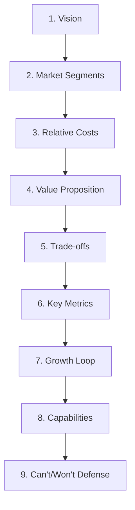

# Startup Canvas

Apply the Startup Canvas framework to evaluate, structure, and iterate product strategies and business models. Explicitly divide corporate operational modeling from strategic product positioning, document business assumptions, map customer jobs-to-be-done, and verify defensibility moats.

## When to Use

- **Drafting initial startup plans** — mapping vision, segments, value proposition, and trade-offs from scratch.
- **Refactoring existing product strategies** due to market shifts, new competitive entrants, or pricing model changes.
- **Defining strategic trade-offs** for product roadmaps — explicitly documenting what the team will *not* build.
- **Evaluating competitive defensibility** — running the "Can't/Won't" alignment loop against named competitors.
- **Defining North Star Metrics** — selecting outcome-based metrics that track value delivery, not vanity counts.
- **Separating product strategy from business model costs** — ensuring unit economics are mapped alongside strategic positioning.

**Trigger keywords**: startup canvas, product strategy, defensibility moat, north star metric, trade-offs, JTBD, jobs to be done, business model, value proposition, competitive moat, relative costs, growth loop.

**Route elsewhere**:
- `saas-mvp-launcher` — to scaffold Next.js repositories.
- `startup-business-analyst-financial-projections` — to model P&L spreadsheets and detailed financial projections.

## Prerequisites

- **Inputs required before starting**: Product name, version, target segments, value propositions, non-goals, cost items, and pricing structures.
- **User research**: At least 15 target user interviews should be completed (or planned) to document primary JTBD before finalizing market segments.
- **Competitor data**: Top 3 competitors profiled for relative cost strategy construction.
- **Framework contrast (BMC / Lean Canvas)**: BMC's nine boxes mix operating model for an ongoing firm. Lean Canvas is problem/solution/unfair-advantage for early teams but is light on relative-cost posture and mandatory non-goals. Startup Canvas splits product strategy from unit economics and requires explicit trade-offs plus Can't/Won't.
- **Schema and YAML**: use the JSON Schema excerpt and YAML Strategic Choice Configuration in Examples. If the team keeps a project-local schema file, validate against that file.

## Procedure

### Step 1 — Establish Vision

1. State the long-term, aspirational purpose of the product team in one to two sentences.
2. Confirm the founding team is aligned on this vision before proceeding.
3. Record the vision in the canvas metadata (top-level `vision` field).

### Step 2 — Define Market Segments via JTBD

1. Interview at least 15 target users to document their primary needs and problems.
2. Define customer cohorts based on shared problems and Jobs-to-be-Done (JTBD) — **not** broad demographics.
3. For each segment, record:
   - `segmentName`: A concise label.
   - `jobsToBeDone`: Array of job statements (e.g., "Secure customer logins quickly without custom coding").

### Step 3 — Establish Relative Cost Posture

1. Profile the top 3 competitors to understand their cost structures.
2. Select one of two postures:
   - **Low-Cost**: Optimizing for minimal operational cost, competing on price efficiency.
   - **Unique-Value**: Delivering premium value that justifies higher costs.
3. Record the posture in `relativeCosts` as either `"Low-Cost"` or `"Unique-Value"`.

### Step 4 — Draft the Value Proposition

Map the customer transformation across three states:

1. **What Before**: Describe the problematic customer state before the product exists.
2. **How**: List the product features and mechanics that resolve this pain.
3. **What After**: Describe the improved, successful customer state after using the product.

Graph your feature offerings against alternatives to map unique value (value curve analysis).

### Step 5 — Declare Trade-offs (Non-Goals)

1. Document at least **5 features or market segments** the team will deliberately ignore.
2. Each trade-off must be specific and actionable (e.g., "No custom on-premises deployments (Cloud only)").
3. **HARD RULE**: Every Startup Canvas must contain at least **3 strategic trade-offs** detailing what the team will *not* build or target. Fewer than 3 is a quality failure.

### Step 6 — Define Key Metrics

1. Select a **North Star Metric (NSM)** that directly tracks value delivery to the customer.
   - **HARD RULE**: NSM must track outcomes, not operational inputs or vanity registration counts. Examples of valid NSMs: "Weekly Active Authentications (WAA)", "Successful automated query completions". Invalid: "Total registered users", "Page views".
2. Select a **One Metric That Matters (OMTM)** for the current planning period.
3. Record both in `keyMetrics`.

### Step 7 — Map the Growth Loop

1. Map customer acquisition, referral, and retention channels.
2. Identify the primary channel (e.g., organic SEO, product-led growth, partnerships).
3. Outline backup channels in case the primary channel saturates.

### Step 8 — Document Capabilities

1. List internal capabilities needed to execute the strategy.
2. Categorize each capability as **Build**, **Buy**, or **Partner**.
3. Record in the `capabilities` array.

### Step 9 — Conduct the "Can't/Won't" Defense Test

1. Identify the primary competitor(s) for the target segment.
2. Run simulations showing how a legacy competitor would react to your positioning.
3. Apply the **Moat Strategy Selection** decision rule:
   - **If competitor is a legacy incumbent**: Focus the moat on **"Won't"** — leverage their innovator's dilemma. Show why offering your value proposition would conflict with their core revenue model (e.g., incumbent won't lower prices because it undercuts their legacy base).
   - **If competitor is a venture-backed startup**: Focus the moat on **"Can't"** — leverage proprietary data loops, custom enterprise workflows, hardware integrations, or patents. Show why they lack the resources or positioning to replicate.
4. **HARD RULE — AI-Era Defensibility**: Traditional technical execution is no longer a sustainable moat due to AI code generation reducing development costs to near zero. Focus the "Can't/Won't" defense on proprietary data loops, custom enterprise workflows, hardware integrations, or strategic misalignments with competitors' business models.
5. **HARD RULE — Weak Moat Warning**: If the "Can't/Won't" analysis does not yield a clear competitive barrier, flag this as a **critical business risk** and suspend feature roadmap development until resolved.

### Step 10 — Map Business Model (Financial Mechanics)

1. **Cost Structure**: Detail fixed and variable expenses (e.g., hosting, API limits, salaries, CAC).
2. **Revenue Streams**: Establish pricing tiers, billing models, and outline expansion revenue paths.
3. Project the cost structure and revenue channels onto a spreadsheet.
4. **HARD RULE**: Never build product strategies without mapping unit economics — this leads to negative margins at scale.

### Step 11 — Identify Risky Hypotheses and Design Validations

1. Highlight the top **3 assumptions** that must be true for the business to survive.
2. Design low-cost validations: landing page tests, clickable prototypes, or concierge MVPs to validate customer demand.
3. Launch validations before committing to full build.

### Step 12 — Output the Canvas

1. Generate the final canvas as **GFM Markdown** containing Mermaid diagram assets.
2. Ensure the output is optimized for direct integration into pitch decks and board presentations.
3. Include the strategic feedback loop diagram:



4. Optionally validate a project-local JSON config against the schema excerpt in Examples (or the team's own schema file).

## Examples

### YAML Strategic Choice Configuration

```yaml
# startup_canvas_config.yaml
metadata:
  product_name: "AuthSentinel"
  revision: "v2.1"
  owner: "product-strategy-team"

strategy:
  vision: "To eliminate authentication friction and security leaks globally."
  relative_cost_posture: "Unique-Value"
  target_segments:
    - name: "Early-stage SaaS Teams"
      jtbd: "Secure customer logins quickly without custom coding."
  trade_offs:
    - "No custom on-premises deployments (Cloud only)"
    - "No integration support for non-standard SAML databases"
    - "No free tier — paid plans only to maintain unit economics"
  key_metrics:
    north_star_metric: "Weekly Active Authentications (WAA)"
    omtm_q2: "Active integrations per tenant"
  cant_wont:
    competitors_cant: "Replicate our zero-knowledge validation latency."
    competitors_wont: "Offer free basic tiers, as it undercuts their enterprise models."
```

### JSON Configuration Schema (Excerpt)

Validate and store Startup Canvas configurations programmatically. Keep a project-local schema if automation needs a file; the excerpt below is the contract:

```json
{
  "$schema": "https://json-schema.org/draft/2020-12/schema",
  "title": "StartupCanvas",
  "type": "object",
  "properties": {
    "productName": { "type": "string" },
    "version": { "type": "string" },
    "lastUpdated": { "type": "string", "format": "date-time" },
    "part1_productStrategy": {
      "type": "object",
      "properties": {
        "vision": { "type": "string" },
        "marketSegments": {
          "type": "array",
          "items": {
            "type": "object",
            "properties": {
              "segmentName": { "type": "string" },
              "jobsToBeDone": { "type": "array", "items": { "type": "string" } }
            },
            "required": ["segmentName", "jobsToBeDone"]
          }
        },
        "relativeCosts": { "type": "string", "enum": ["Low-Cost", "Unique-Value"] },
        "valueProposition": {
          "type": "object",
          "properties": {
            "beforeState": { "type": "string" },
            "solutionMechanisms": { "type": "array", "items": { "type": "string" } },
            "afterState": { "type": "string" }
          },
          "required": ["beforeState", "solutionMechanisms", "afterState"]
        },
        "tradeOffs": { "type": "array", "items": { "type": "string" } },
        "keyMetrics": {
          "type": "object",
          "properties": {
            "northStarMetric": { "type": "string" },
            "oneMetricThatMatters": { "type": "string" }
          },
          "required": ["northStarMetric", "oneMetricThatMatters"]
        },
        "growth": { "type": "string" },
        "capabilities": { "type": "array", "items": { "type": "string" } },
        "cantWontDefensibility": { "type": "string" }
      },
      "required": ["vision", "marketSegments", "relativeCosts", "valueProposition", "tradeOffs", "keyMetrics", "growth", "capabilities", "cantWontDefensibility"]
    },
    "part2_businessModel": {
      "type": "object",
      "properties": {
        "costStructure": { "type": "array", "items": { "type": "string" } },
        "revenueStreams": { "type": "array", "items": { "type": "string" } }
      },
      "required": ["costStructure", "revenueStreams"]
    }
  },
  "required": ["productName", "version", "lastUpdated", "part1_productStrategy", "part2_businessModel"]
}
```

## Pitfalls

- **Feature Chasing**: Violating documented strategic trade-offs by building custom features for individual clients. This dilutes product focus and turns a product company into a services agency. **Prevention**: Reference trade-offs before every roadmap decision; reject features that violate non-goals.
- **Single-Feature Moats**: Relying on a single feature for defensibility. Competitors can replicate features quickly; sustainable defensibility requires a *system* of strategic choices. **Prevention**: The "Can't/Won't" defense must cite at least two reinforcing barriers.
- **Vanity Metrics as North Star**: Using metrics like total registered users as the NSM. **Prevention**: NSM must measure active value delivery (e.g., successful system queries, weekly active authentications), not registration counts or seat usage.
- **Separation of Strategy and Finance**: Building product strategies without mapping unit economics, leading to negative margins at scale. **Prevention**: Always complete Step 10 (Business Model) before finalizing the canvas.
- **Demographic Segmentation**: Basing market segments on demographics instead of JTBD. **Prevention**: Every segment must have at least one documented job statement derived from user interviews.
- **AI-Era Moat Illusion**: Believing technical execution speed or code quality is a defensible moat. AI code generation has reduced development costs to near zero. **Prevention**: Focus moats on proprietary data, workflows, hardware, or business model misalignments — never on "we build faster."
- **Weak Moat Not Flagged**: Proceeding with roadmap development when the "Can't/Won't" analysis yields no clear barrier. **Prevention**: Suspend feature roadmap development until a defensible moat is identified.

## Verification

Run these checks on every completed Startup Canvas:

1. **Trade-off count**: Confirm at least 3 strategic trade-offs are documented.
   - Check: `grep -c "trade_offs" startup_canvas_config.yaml` or count items in the `tradeOffs` JSON array. Must be ≥ 3.

2. **North Star Metric quality**: Confirm the NSM tracks value delivery, not vanity.
   - Check: Does the NSM measure an outcome (e.g., "successful authentications") rather than an input (e.g., "signups")? If it contains words like "registered", "total", or "page views", reject and revise.

3. **JTBD presence**: Confirm every market segment has at least one job statement.
   - Check: In the JSON/YAML, verify each item in `marketSegments` / `target_segments` has a non-empty `jobsToBeDone` / `jtbd` array.

4. **Moat strength**: Confirm the "Can't/Won't" defense cites at least one barrier that is NOT pure technical execution.
   - Check: Read `cantWontDefensibility`. If it only references code quality, speed, or engineering talent, flag as weak moat and trigger the Weak Moat Warning.

5. **Business model completeness**: Confirm both `costStructure` and `revenueStreams` are populated.
   - Check: Both arrays in `part2_businessModel` must be non-empty.

6. **JSON schema validation** (if using JSON config):
   ```powershell
   # Point -s at a project-local schema that matches the excerpt in Examples
   npx ajv validate -s startup_canvas.schema.json -d startup_canvas_config.json
   ```
   Expected output: `startup_canvas_config.json valid`

7. **Mermaid diagram renders**: Confirm the strategic feedback loop diagram renders correctly in GFM Markdown preview.

## Related Skills

- `saas-mvp-launcher` — Scaffold Next.js repositories after strategy is finalized.
- `startup-business-analyst-financial-projections` — Model detailed P&L spreadsheets from the business model section.

## Source Anchors

- [The Product Compass Strategic Canvas Guides](https://www.productcompass.pm/p/product-strategy-canvas)
- [BVP SaaS Growth Benchmarks](https://www.bvp.com/atlas)

## Changelog

- `2026-05-30`: Initial modernization pass. Converted to active voice, updated YAML metadata, removed boilerplate sections, and updated defensibility criteria to account for AI-assisted development cost reductions.
- `2026-05-31`: Production-grade rewrite. Added explicit procedure steps, hard rules, verification checks, reference file loading instructions, and decision rules for moat strategy selection.
