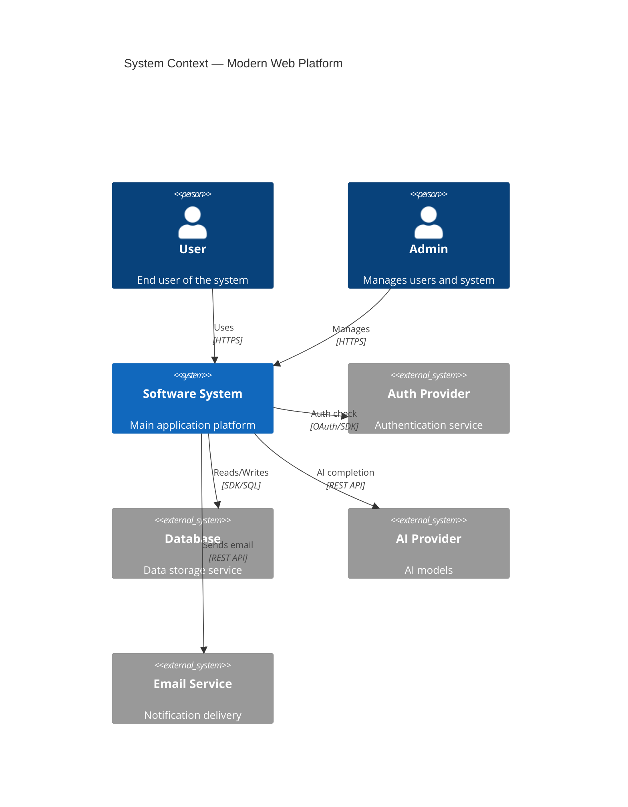
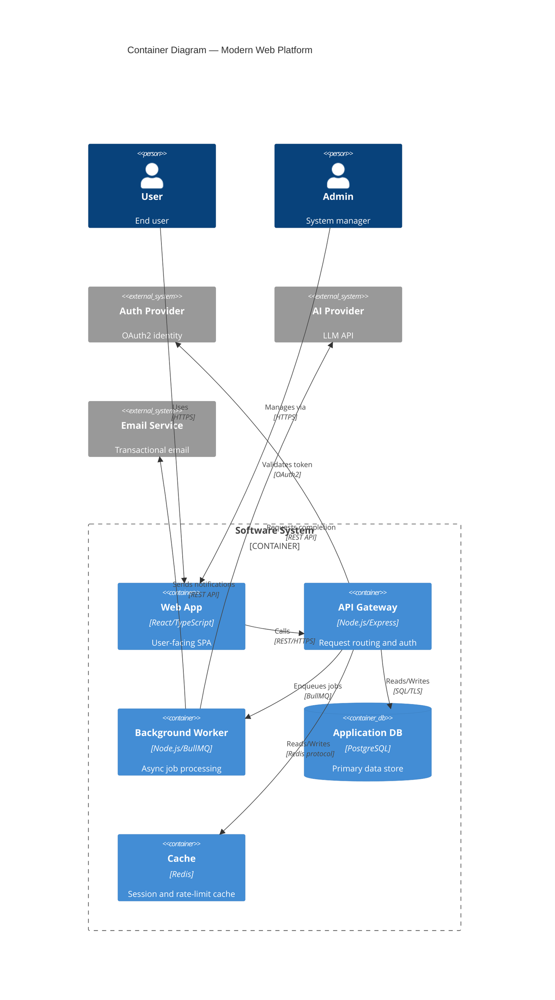
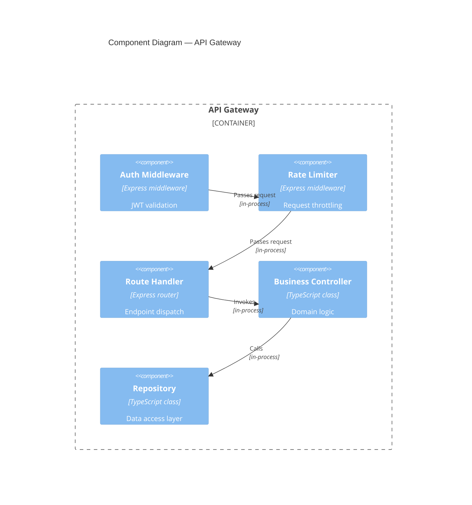
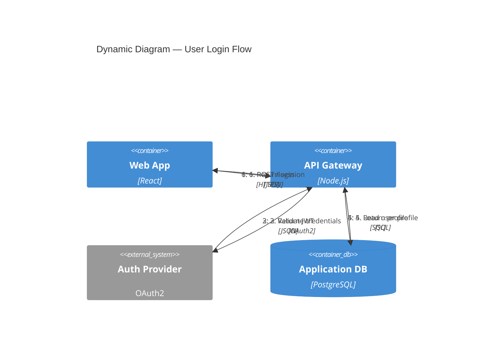
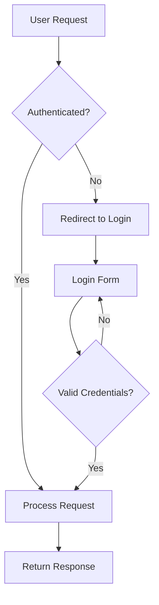
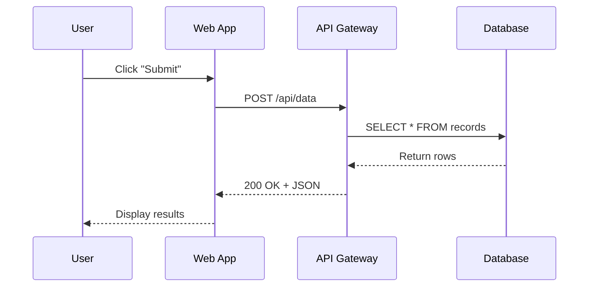
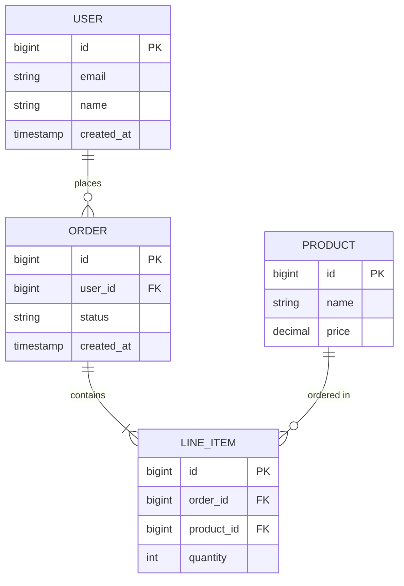
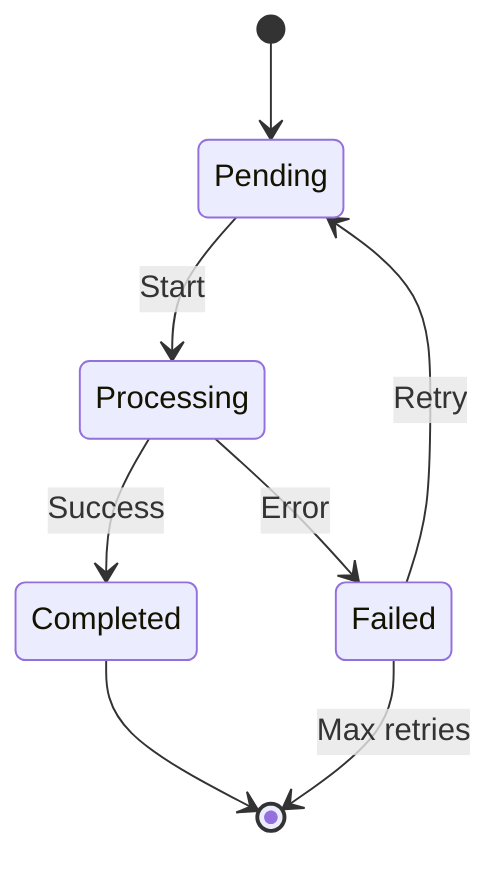
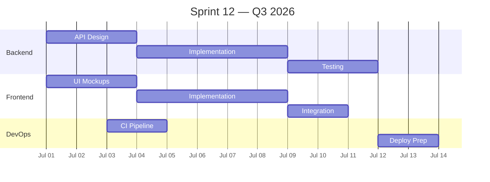
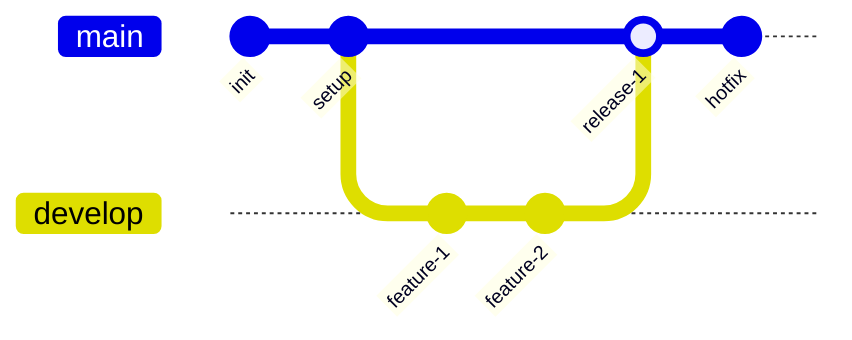

# Technical Diagram Expert

Single-source skill for architecture documentation and technical visualization. Covers C4 model diagrams and all Mermaid diagram types, plus UI/UX visual design guidance.

## When to Use

- Documenting system architecture or component structure
- Visualizing feature flows or API sequences
- Creating ERDs or data model diagrams
- Planning sprints or release timelines with Gantt charts
- Adding diagrams to PRs or technical documentation
- Onboarding new developers with architecture explanations
- Designing or reviewing UI/UX, accessibility, responsive layouts, or design systems

## Prerequisites

- Mermaid CLI or a Markdown renderer that supports Mermaid (GitHub, GitLab, Cursor, VS Code with Mermaid extension)
- For C4 diagrams: a renderer that supports `C4Context`, `C4Container`, `C4Component`, `C4Deployment`, and `C4Dynamic` diagram types (Mermaid v10+ or Structurizr)
- Windows host is primary. Use PowerShell for all file operations.

## Procedure

### 1. Select the Diagram Type

#### C4 Model — Architecture Documentation

| Level | Type | Audience | Shows |
|-------|------|----------|-------|
| 1 | `C4Context` | Everyone | System + external actors |
| 2 | `C4Container` | Technical team | Apps, DBs, services |
| 3 | `C4Component` | Developers | Internal components |
| 4 | `C4Deployment` | DevOps | Infrastructure nodes |
| — | `C4Dynamic` | Technical team | Numbered request flows |

**Rule**: Context + Container diagrams are sufficient for most teams. Only create Component/Code diagrams when they add real value.

#### Mermaid — General Visualization

| Situation | Diagram Type |
|-----------|-------------|
| Step-by-step process, decision tree | `graph` (flowchart) |
| API interactions, inter-service calls | `sequenceDiagram` |
| Data model, relationships | `erDiagram` |
| Object hierarchy | `classDiagram` |
| State machine, lifecycle | `stateDiagram-v2` |
| Sprint/release plan | `gantt` |
| Proportions, ratios | `pie` |
| User journey | `journey` |
| Git branch strategy | `gitGraph` |

### 2. Create C4 Diagrams

#### System Context (Level 1)



#### Container (Level 2)



#### Component (Level 3) — Only When It Adds Value



#### Deployment (Level 4)

```mermaid
C4Deployment
  title Deployment Diagram — Production

  Deployment_Node(prod, "Production", "AWS") {
    Deployment_Node(vpc, "VPC", "Virtual network") {
      Deployment_Node(alb, "ALB", "Application Load Balancer") {
        Container(webApp, "Web App", "React/TypeScript", "SPA")
      }
      Deployment_Node(ecsCluster, "ECS Cluster", "Fargate") {
        Container(apiGateway, "API Gateway", "Node.js", "API service")
        Container(worker, "Worker", "Node.js", "Job processor")
      }
      Deployment_Node(rds, "RDS", "Managed DB") {
        ContainerDb(appDb, "Application DB", "PostgreSQL", "Primary store")
      }
    }
  }

  Rel(alb, apiGateway, "Routes to", "HTTPS")
  Rel(apiGateway, appDb, "Reads/Writes", "SQL/TLS")
  Rel(apiGateway, worker, "Enqueues", "BullMQ")
```

#### Dynamic (Request Flow)



### 3. Create Mermaid Diagrams

#### Flowchart



#### Sequence Diagram



#### ERD



#### State Diagram



#### Gantt Chart



#### Git Graph



### 4. Write Diagrams to Output Locations

Use this directory structure for architecture documentation:

```powershell
New-Item -ItemType Directory -Force -Path "docs\architecture"
```

```
docs/architecture/
  c4-context.md              # System context diagram
  c4-containers.md           # Container diagram
  c4-deployment.md           # Deployment diagram
  c4-dynamic-{flow}.md       # Specific flow diagrams
  c4-components-{feature}.md # Feature-based component diagrams
```

Write each diagram to its own file:

```powershell
# Example: write context diagram
Set-Content -Path "docs\architecture\c4-context.md" -Encoding UTF8 -Value @"
# System Context

```mermaid
C4Context
  title System Context — Modern Web Platform
  ...
```
"@
```

### 5. Apply C4 Best Practices

1. **Each element**: Name + Type + Technology + Description (short, max 50 characters).
2. **Unidirectional arrows only**: Bidirectional arrows create ambiguity.
3. **Arrow labels start with action verbs**: "Reads", "Writes", "Sends", "Validates".
4. **Add technology labels**: "JSON/HTTPS", "SDK", "SQL/TLS".
5. **Max 20 elements per diagram**: Split into multiple diagrams if exceeded.
6. **One diagram per file**: Keeps documentation navigable and diff-friendly.

### 6. Apply UI/UX Visual Design Guidance (2026)

When the task involves visual design, UI review, or frontend implementation:

1. **Define audience and constraints**: target users, primary task, platform, viewport range, existing design system, accessibility requirements, brand constraints, data density, interaction states, success metric.
2. **Start from user task and information architecture**, not decoration.
3. **Map key states**: empty, loading, success, error, disabled, permission-limited, offline, and responsive variants.
4. **Apply accessibility early**: keyboard flow, focus visibility, labels, contrast, reduced motion, touch targets, text resizing, semantic structure.
5. **Use design-system primitives** where available; otherwise define tokens for spacing, color, type, elevation, radius, and motion.
6. **Design responsive layouts** with stable dimensions and no text overlap across desktop and mobile.
7. **Validate with realistic content**: long labels, error text, touch/keyboard interaction.
8. **Deliver concrete implementation guidance**, not vague aesthetic notes.

**Output format for UI/UX tasks**: user goal, layout structure, component list, states, accessibility checks, responsive behavior, copy notes, and verification steps. For code tasks, include exact files/components and testing guidance.

## Pitfalls

- **Do not write comment lines in code or configuration files.** This is a hard rule — diagrams go in Markdown files, not as inline comments in source code.
- **Do not create Component/Code diagrams by default.** They add maintenance burden. Only create them when they provide real value to the team.
- **Bidirectional arrows in C4 diagrams** create ambiguity about which system initiates the interaction. Always use unidirectional arrows.
- **Overloaded diagrams** (more than 20 elements) become unreadable. Split into multiple focused diagrams.
- **Missing technology labels** on relationships make diagrams vague. Always specify protocol/format: "HTTPS", "SQL/TLS", "REST API".
- **Vague arrow labels** like "interacts with" or "connects to" carry no information. Use action verbs: "Reads", "Writes", "Sends", "Validates".
- **Multiple diagrams in one file** make navigation and diffing harder. One diagram per file.
- **UI polish over weak structure**: visual decoration cannot fix poor information architecture. Structure first, polish second.
- **Ignoring accessibility**: contrast, keyboard navigation, screen reader support, and reduced motion are not optional add-ons.
- **Fragile viewport-scaled text**: do not rely on CSS viewport units for body text; it causes overlap on narrow and wide screens.

## Verification

### Verify Mermaid Syntax

Check that diagram files contain valid Mermaid syntax:

```powershell
# List all architecture diagram files
Get-ChildItem -Path "docs\architecture" -Filter "*.md" | Select-Object Name, Length

# Verify each file starts with a heading and contains a mermaid block
Get-ChildItem -Path "docs\architecture" -Filter "*.md" | ForEach-Object {
  $content = Get-Content $_.FullName -Raw
  $hasHeading = $content -match '^#\s'
  $hasMermaid = $content -match '```mermaid'
  Write-Output "$($_.Name): heading=$hasHeading mermaid=$hasMermaid"
}
```

### Verify C4 Element Count

```powershell
# Check that no C4 diagram exceeds 20 elements
Get-ChildItem -Path "docs\architecture" -Filter "c4-*.md" | ForEach-Object {
  $content = Get-Content $_.FullName -Raw
  $elementCount = ([regex]::Matches($content, '(?m)^(Person|System|System_Ext|Container|ContainerDb|Component|Deployment_Node)\b')).Count
  Write-Output "$($_.Name): elements=$elementCount $(if($elementCount -gt 20){'WARN: exceeds 20'}else{'OK'})"
}
```

### Verify Output Directory Structure

```powershell
# Confirm architecture docs directory exists and has content
Test-Path "docs\architecture"
(Get-ChildItem "docs\architecture" -Filter "*.md").Count
```

Expected output: `True` and a file count greater than 0.

### Verify UI/UX Quality Checklist

- [ ] User can complete the core task quickly and repeatedly.
- [ ] UI supports keyboard, screen readers, visible focus, and sufficient contrast.
- [ ] Mobile and desktop layouts do not overlap or rely on fragile viewport-scaled text.
- [ ] Controls use familiar affordances and expose state clearly.
- [ ] Motion is purposeful and respects reduced-motion preferences.
- [ ] Visual direction is intentional and consistent with the product domain.
- [ ] Diagrams have boundaries, labels, legends, and update ownership.

## Related Skills

- `documentation-writer` — for broader technical documentation structure
- `code-reviewer` — for reviewing diagram accuracy against actual codebase

## References

- W3C WCAG 2.2: https://www.w3.org/TR/WCAG22/
- W3C Understanding WCAG 2.2: https://www.w3.org/WAI/WCAG22/Understanding/intro
- W3C WCAG FAQ: https://www.w3.org/WAI/standards-guidelines/wcag/faq/
- Apple Human Interface Guidelines: https://developer.apple.com/design/human-interface-guidelines
- Material Design 3: https://m3.material.io/
- Material accessibility guidance: https://m2.material.io/design/usability/accessibility.html
- Mermaid official docs: https://mermaid.js.org/intro/
- C4 model: https://c4model.com/
